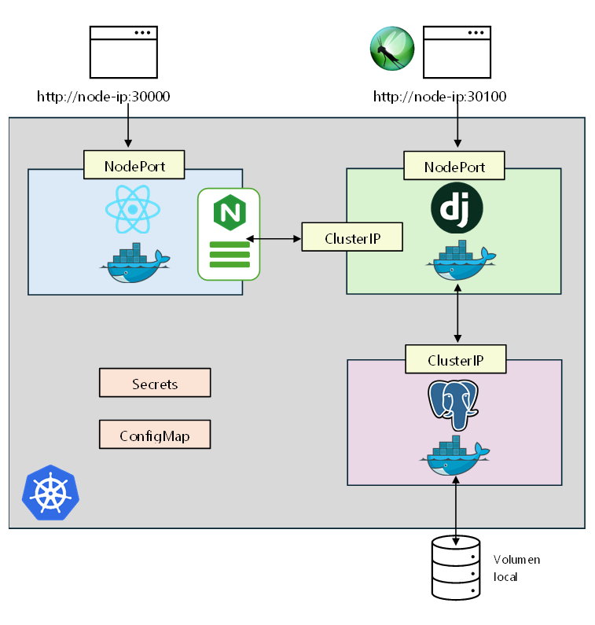

# Infraestructuras Paralelas y Distribuidas - 750023C 01
## Proyecto final

### Autores:
- [Samuel Galindo Cuevas](https://github.com/SakyJoestar) - 2177491
- [Nicolás Herrera Marulanda](https://github.com/Herreran903) - 2182551
- [Christian David Vargas Gutiérrez](https://github.com/ChristianV2426/)- 2179172

### Profesor:
John Sanabria PhD


## Infraestructura de la aplicación



La aplicación se desplegó en Kubernetes, usando un único nodo local de Minikube. Para ejecutar la aplicación, es necesario tener activos los servicios de Docker, Minikube, Kubectl y seguir los siguientes pasos:

1. Clonar el repositorio

```bash
git clone https://github.com/ChristianV2426/Proyecto-Final-Infraestructuras 

cd Proyecto-Final-Infraestructuras
```

2. Desplegar las diferentes configuraciones y servicios de Kubernetes

```bash
kubectl apply -f backend-config.yaml \
-f backend-secrets.yaml \
-f database-volume.yaml \
-f database-deployment.yaml \
-f backend-deployment.yaml \
-f frontend-deployment.yaml
```

- O en una sola linea de comandos

```bash
kubectl apply -f backend-config.yaml -f backend-secrets.yaml -f database-volume.yaml -f database-deployment.yaml -f backend-deployment.yaml -f frontend-deployment.yaml
```


1. Obtener la dirección IP del servicio de frontend o backend, según se desee, y empezar a interactuar con la aplicación

```bash
minikube service frontend-service --url
```
o bien
```bash
minikube service backend-service --url
```

La aplicación está pensada para ser altamente modular. Como primer paso del despliegue, se montan los contextos de los que dependen los servicios, como las variables de entorno y los secretos (todos los pods del nodo tienen acceso a estos contextos). Luego, se le asigna un volumen persistente al que será el pod de la base de datos. Este volumen es un espacio del disco local sobre el que corre el nodo de Kubernetes. A continuación, se despliega el pod de la base de datos, que se conecta al volumen persistente.

Paso seguido, se despliega el pod del backend, que se conecta al pod de la base de datos mediante un servicio ClusterIP, además de exponer un servicio NodePort para que el usuario pueda interactuar directamente con el backend a través de la consola o del navegador. Por último, se despliega el pod del frontend, que se conecta al pod del backend mediante un servicio ClusterIP, además de también exponerse mediante un servicio NodePort.
